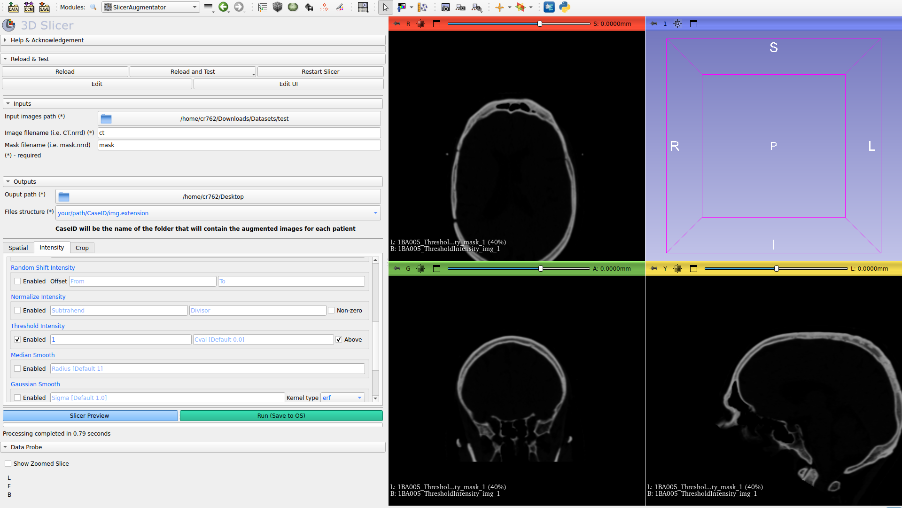
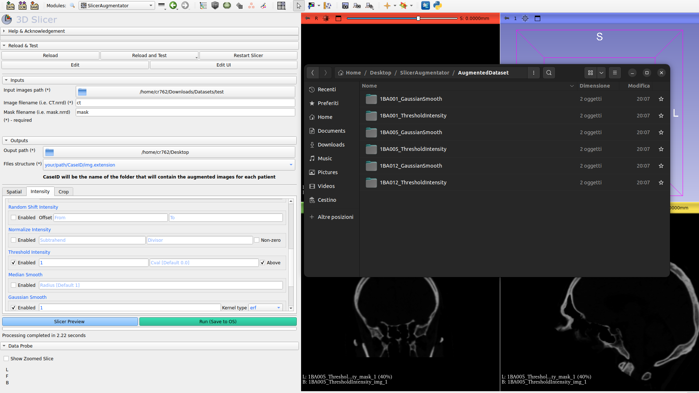

# SlicerAugmentator

## Project Description
MONAI and PyTorch based medical image augmentation tool that can be integrated in Slicer.
The project aims to be a low-code version of the tool: <https://github.com/ciroraggio/AugmentedDataLoader>.

It's designed to operate on a dataset of medical images and apply a series of specific transformations to each image. This process augments the original dataset, providing a greater variety of samples for training deep learning models.

## Chengelog
 - v0.3:
    1. Updated UI
    2. Added device choice
    3. Bugs fixed
    
 - v0.2:
    1. Completed preview mode 
    2. Added spatial and intensity transformations
    3. New interface
    4. Bugs fixed
    
 - v0.1:
    1.  Implemented interface for loading images and masks, choosing transformations and saving images.
    2.  Implemented and tested MONAI spatial transformations such as Rotation, RandRotation, Flip, Resize.
    3.  Partially implemented input validation and MONAI intensity transformations, it will be completed in the future.
    4.  Partially implemented "Preview" feature, which allows the output of transformations to be viewed directly in the scene before saving them in the OS, will be completed in the future.

# Illustrations [<ins>v0.3</ins>]

Files are saved as follows:

## Contributors
- C. B. Raggio (<https://github.com/ciroraggio>)
- P. Zaffino (<https://github.com/pzaffino>)

